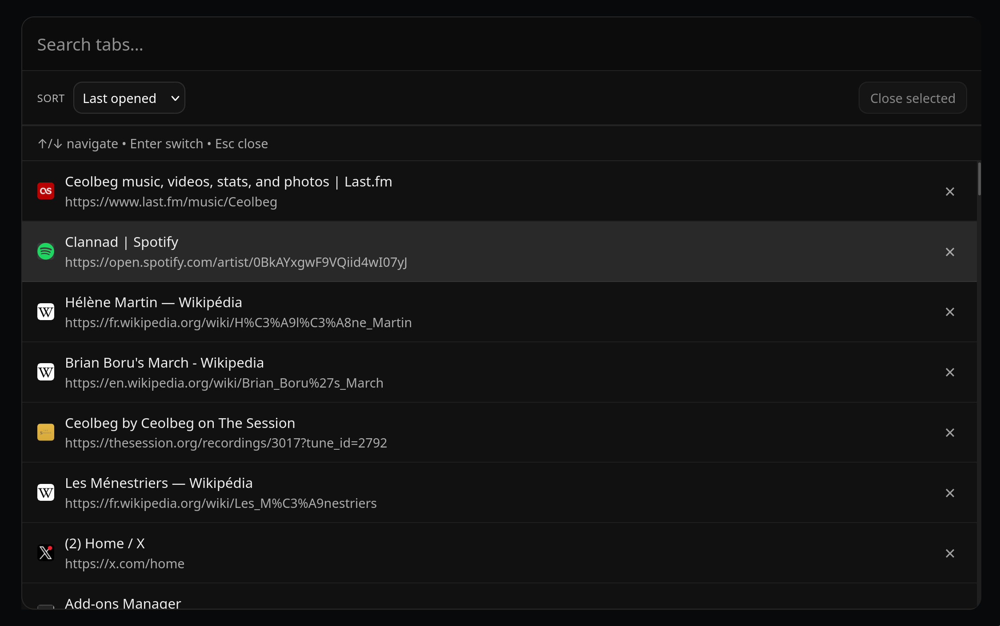

# Tab Palette

[](./demo.png)

Tab Palette is a tab switcher for Chromium and Firefox.

It opens a searchable palette over the current page, lets you navigate, filter and sort tabs, and close one or many tabs without taking your hands off the keyboard.

## Features

- Search tabs by title and URL
- Optionally include tab group names in search
- Sort by last opened, alphabetical order, or tab group
- Filter to all tabs, a specific group, or ungrouped tabs
- Keyboard navigation with quick switching
- Multi-select tabs and close them in one action
- Chromium side panel support, with overlay mode shared across browsers

## Keyboard Controls

- `Ctrl+Shift+A` / `Cmd+Shift+A`: open the palette
- `ArrowUp` / `ArrowDown`: move selection
- `PageUp` / `PageDown`: jump by visible page
- `Home` / `End`: jump to start or end
- `Enter`: activate selected tab
- `Esc`: close the palette
- `Backspace` / `Delete`: close selected tabs when multi-selection is active

## Options

The options page supports:

- Default sort mode
- Remember last used sort mode
- Enable or disable group features
- Default group filter
- Remember last used group filter
- Include group names in search
- Show or hide keyboard hints
- UI scale

## Local Development

### Load in Chromium

1. Open `chrome://extensions`
2. Enable Developer mode
3. Choose `Load unpacked`
4. Select the repo root

### Load in Firefox

1. Build the Firefox directory:

```bash
bash build-firefox.sh
```

2. Open `about:debugging`
3. Open `This Firefox`
4. Choose `Load Temporary Add-on`
5. Select [`dist/firefox/manifest.json`](./dist/firefox/manifest.json)

## Build

Run:

```bash
bash build-firefox.sh
```

This does two things:

- rebuilds the unpacked Firefox extension in [`dist/firefox`](./dist/firefox)
- packages a Firefox zip via `web-ext` into [`web-ext-artifacts`](./web-ext-artifacts)

Current packaged artifact name:

- [`web-ext-artifacts/tab_palette-x.y.z.zip`](./web-ext-artifacts/tab_palette-x.y.z.zip)